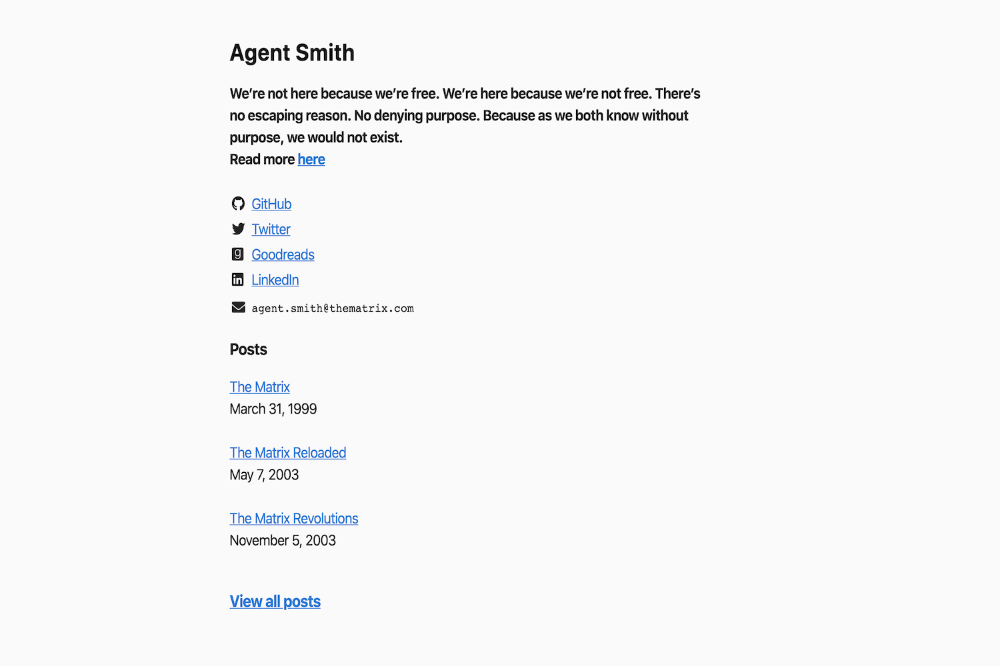

# Lekh
Simple, text-focussed and minimal personal portfolio theme based on https://github.com/vegarsti/vegarsti.github.io

## Screenshot


## Features
* Social media links
* Markdown supported
* Easy to personalize
 - TODO
   - Dark mode
   - RSS feeds


## Installation

cd into your hugo site's root directory and:

```sh
cd themes
git clone https://github.com/invinciblycool/lekh.git
```

For more information read the [official setup guide](https://gohugo.io/overview/installing/) of Hugo.


## Personalization

To personalize the theme

`cp themes/lekh/.personalize.toml data/personalize.toml`

And then customize accordingly.

Or simply copy the below into a new file called `data/personalize.toml` and customize accordingly.

```toml

Name = ""

# Supports markdown
About = ""

# Add only the handle
Github = ""
Twitter = ""

# Add the absolute links
Goodreads = ""
Linkedin = ""

Email = ""

# Add the filename with file extension.
Resume = ""

# Sets the number of posts to display on the front page
PostLimit = 4

```

## Posts

Below is a typical post, which defaults to what Hugo expects.

Specify `draft: true` to avoid publishing the post.

```md
---
title: "Rant post"
date: "2020-04-02"
draft: true
---

Too much to rant :(
```

## Credits

* Thanks to [Vegard's](https://github.com/vegarsti) personal site from which the theme was heavily inspired.

Feel free to contribute and open issues.
